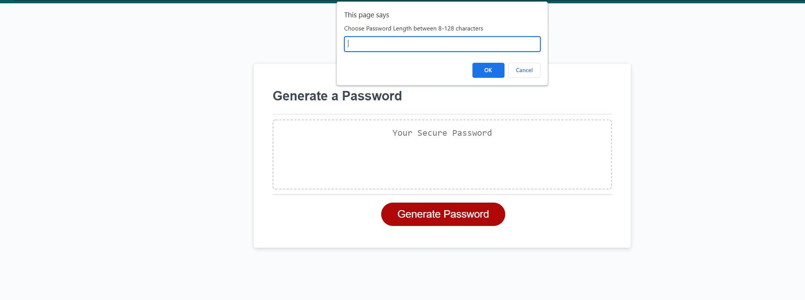

# PasswordGenerator

When designing this program I would aiming to meet all necessary criteria while utilizing the code we have learned while covering Javascript. Also, wanted to generate something what would be easy for the user to understand how the program worked and use to generate a password. 

It solves the problem of helping a user generate a unique password that includes specific requirements. Requirements are selected by user via questions about variables they would like to include. 

The process of mapping out my goal and how I wanted to accomplish coding this program was much easier this time around. I was more succesfful in breaking down the pieces into chunks I could manage. I did have to do some research to confirm and assist in cleaning up the steps required to create a successful code. Overall it was a successful experience combining the teaching throughout the week with some outside research I did to help accomplish the goal. 

Some screen shots of the program, highlightning the word and code put into it.

Main Page User Sees at Load:

Alert After Pushing Generate Password button confirming desired length of password

Alert informing user they must select length between 8-128 if they fail to.

First Confirm: Would you like to use lower case letters:

Second Confirm: Would you like to include upper case letters:

Third Confirm: Would you like to include numbers:

Fourth Confirm: Would you like to include special characters:

Validating to ensure user chose at least one of the required criteria. Alerting them if none were selected:

Successful password Generated:

URL: https://jmak21203.github.io/PasswordGenerator/

